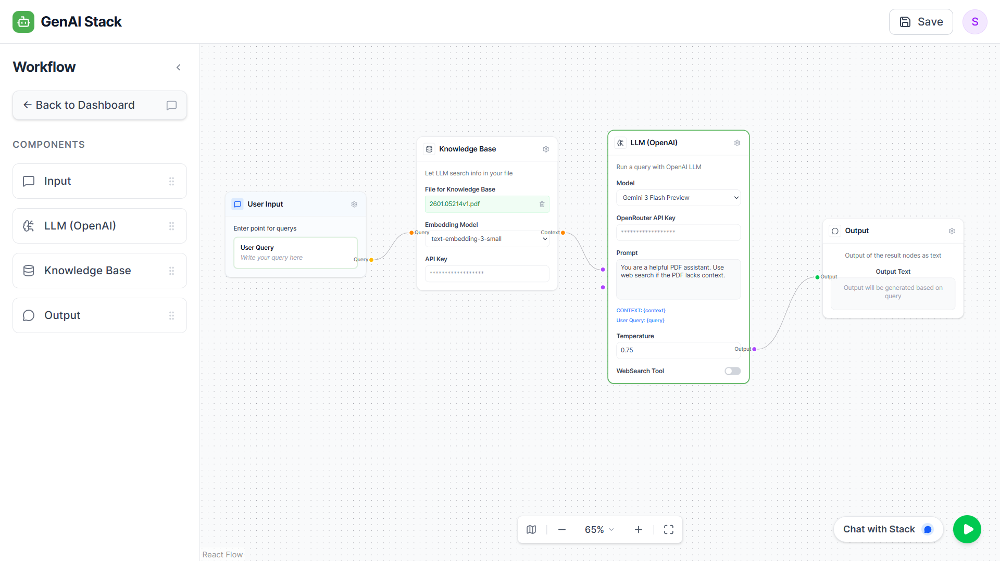

# AI Workflow Builder

A Full-Stack No-Code/Low-Code web application that enables users to visually create and interact with intelligent workflows. Connect Knowledge Bases, LLMs, and Web Search to build powerful AI agents.

<p align="center">
  
</p>

## Features

- **Visual Workflow Builder**: Drag-and-drop interface using React Flow.
- **Multi-Model Support**: Access bleeding-edge 2026 models via **OpenRouter** (Gemini 3 Flash, GPT-5.2, DeepSeek R1, Claude Opus 4.5).
- **RAG (Retrieval Augmented Generation)**: Upload PDFs to create a Knowledge Base with vector search (ChromaDB).
- **Web Search**: Integrated SerpAPI for real-time web context.
- **Interactive Chat**: Test your workflows immediately in a chat interface.
- **Dockerized**: specific Dockerfiles for web and backend, plus docker-compose for easy orchestration.

## Tech Stack

- **Frontend**: React.js, TypeScript, Tailwind CSS, Vite, React Flow
- **Backend**: Python, FastAPI, Uvicorn
- **AI/ML**: OpenRouter (LLM), OpenAI (Embeddings), ChromaDB (Vector Store), SerpAPI (Search)
- **Database**: PostgreSQL (Metadata & Workflow Storage)
- **Infrastructure**: Docker, Docker Compose

## Architecture

```
┌─────────────────────────────────────────────────────────────────┐
│                          FRONTEND                                │
│  ┌──────────────┐  ┌──────────────────┐  ┌──────────────────┐   │
│  │  Dashboard   │  │ Workflow Builder │  │   Chat Modal     │   │
│  │  (CRUD)      │  │   (React Flow)   │  │   (Execution)    │   │
│  └──────────────┘  └──────────────────┘  └──────────────────┘   │
└─────────────────────────────────────────────────────────────────┘
                              │ REST API
                              ▼
┌─────────────────────────────────────────────────────────────────┐
│                          BACKEND                                 │
│  ┌────────────────────────────────────────────────────────────┐ │
│  │                    FastAPI Routers                          │ │
│  │  /workflows (CRUD)  │  /documents (Upload)  │  /run_workflow│ │
│  └────────────────────────────────────────────────────────────┘ │
│                              │                                   │
│  ┌────────────────────────────────────────────────────────────┐ │
│  │                    Core Services                            │ │
│  │  • Vector Store (ChromaDB)    • LLM Client (OpenRouter)    │ │
│  │  • Text Extraction (PyMuPDF)  • Web Search (SerpAPI)       │ │
│  └────────────────────────────────────────────────────────────┘ │
└─────────────────────────────────────────────────────────────────┘
                    │                         │
                    ▼                         ▼
         ┌──────────────────┐      ┌─────────────────────┐
         │   PostgreSQL     │      │   External APIs     │
         │   (Metadata)     │      │  • OpenRouter       │
         └──────────────────┘      │  • OpenAI           │
                                   │  • SerpAPI          │
                                   │  • Cloudflare R2    │
                                   └─────────────────────┘
```

## Getting Started

### Prerequisites

- Node.js 18+
- Python 3.11+
- Docker & Docker Compose (optional, for containerized run)
- API Keys:
    - **OpenRouter API Key** (for LLMs)
    - **OpenAI API Key** (for Embeddings)
    - **SerpAPI Key** (optional, for web search)
    - **Cloudflare R2** (optional, for file storage - falls back to local)

> 📖 **Need help getting API keys?** See the detailed **[SETUP_GUIDE.md](./SETUP_GUIDE.md)** for step-by-step instructions.

### Installation (Local)

1. **Clone the repository:**
   ```bash
   git clone https://github.com/surajsingh0/ai-workflow-builder.git
   cd ai-workflow-builder
   ```

2. **Backend Setup:**
   ```bash
   cd backend
   python -m venv venv
   source venv/bin/activate  # On Windows: venv\Scripts\activate
   pip install -r requirements.txt
   
   # Setup .env
   cp .env.example .env
   # Edit .env with your API Keys
   
   # Run
   uvicorn main:app --reload
   ```

3. **Frontend Setup:**
   ```bash
   cd web
   npm install
   npm run dev
   ```

4. **Access:**
   Open `http://localhost:5173` in your browser.

### Installation (Docker)

1. Create a `.env` file in the root directory with your keys:
   ```env
   OPENAI_API_KEY=sk-...
   OPENROUTER_API_KEY=sk-or-...
   SERPAPI_API_KEY=...
   ```

2. Run Docker Compose:
   ```bash
   docker-compose up --build
   ```

3. Access the application at `http://localhost:3000`.

## API Documentation

Once the backend is running, visit `http://localhost:8000/docs` for the interactive Swagger UI.

## Source Code Documentation

### Architecture Documents
- **[HIGH_LEVEL_DESIGN.md](./HIGH_LEVEL_DESIGN.md)** - System overview, architecture diagrams, data flow
- **[LOW_LEVEL_DESIGN.md](./LOW_LEVEL_DESIGN.md)** - Database schemas, API specs, algorithms, component hierarchy

### Backend Structure (`/backend`)
| File | Description |
|------|-------------|
| `main.py` | FastAPI app entry point, CORS config, router registration |
| `database.py` | SQLAlchemy engine, session factory, Base model |
| `models.py` | ORM models: `Workflow`, `Document` |
| `schemas.py` | Pydantic schemas for request/response validation |
| `vector_store.py` | ChromaDB client, embedding functions, query/add operations |
| `r2_client.py` | Cloudflare R2 (S3-compatible) storage client |
| `routers/workflows.py` | CRUD endpoints for workflow management |
| `routers/documents.py` | File upload, text extraction, embedding pipeline |
| `routers/workflow_run.py` | Workflow execution engine (graph traversal, LLM calls) |

### Frontend Structure (`/web/src`)
| File/Folder | Description |
|-------------|-------------|
| `App.tsx` | React Router configuration |
| `config.ts` | API base URL and endpoint constants |
| `pages/Dashboard.tsx` | Workflow listing, create/delete operations |
| `pages/builder/WorkflowBuilder.tsx` | Main canvas with React Flow, validation, chat |
| `pages/builder/Sidebar.tsx` | Draggable component palette |
| `pages/builder/nodes/*.tsx` | Individual node components (UserQuery, LLM, KB, Output) |
| `components/Header.tsx` | App header with save button |
| `components/ChatModal.tsx` | Chat interface for workflow execution |

### Key Algorithms
1. **Workflow Execution** (`workflow_run.py`): Traverses the node graph, aggregates context from KB/Web, calls LLM
2. **Document Processing** (`documents.py`): Upload → Extract → Chunk → Embed → Store
3. **Validation** (`WorkflowBuilder.tsx`): Checks for required nodes and connections

## Contributing

1. Fork the repository
2. Create a feature branch (`git checkout -b feature/amazing-feature`)
3. Commit your changes (`git commit -m 'Add amazing feature'`)
4. Push to the branch (`git push origin feature/amazing-feature`)
5. Open a Pull Request

## License

MIT
