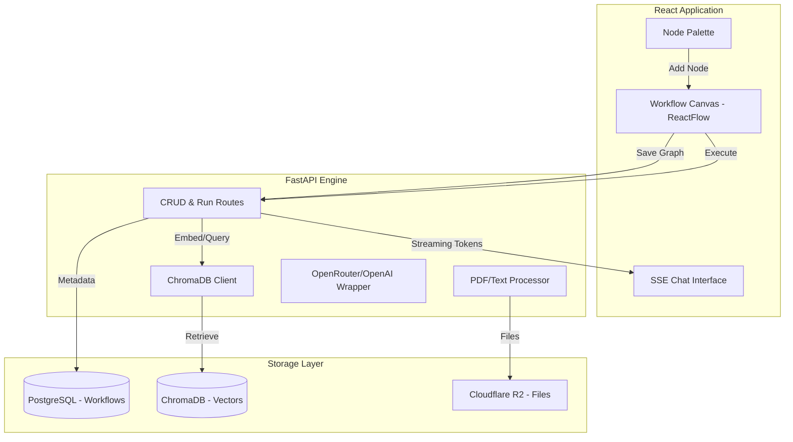
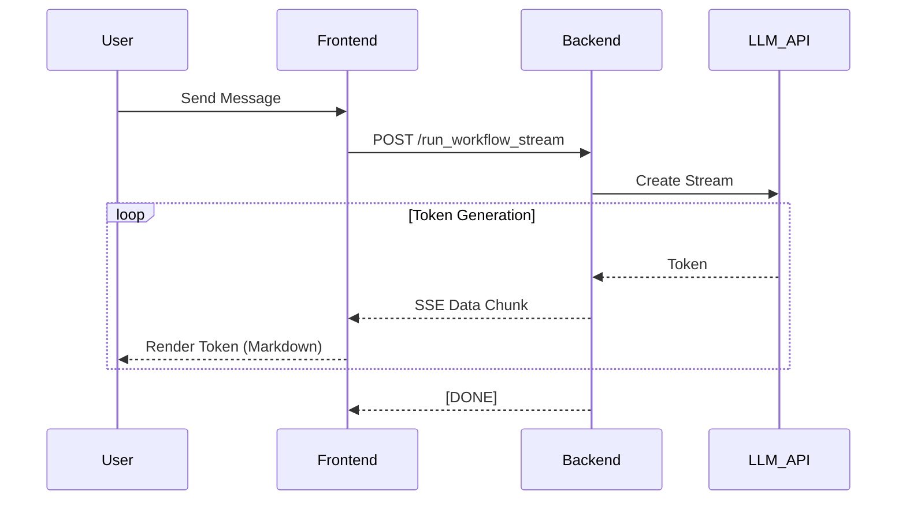

# 🛠️ Source Code Documentation: AI Workflow Builder

This document provides an exhaustive deep-dive into the architectural design, implementation details, and component interactions of the AI Workflow Builder. It is designed to guide developers through the codebase and explain the "why" behind technical decisions.

---

## 🏗️ 1. High-Level Architecture

The system follows a **Separation of Concerns (SoC)** principle, decoupled into three primary layers: **UI/UX Layer (React)**, **API Logic Layer (FastAPI)**, and **Intelligence/Data Layer (Vector & Relational DBs)**.

### 📊 System Flow Diagram

---

## 🧩 2. Core Components & Roles

### 🔵 Frontend (UI Layer)
| Component | Role | Interaction |
|-----------|------|-------------|
| **`WorkflowBuilder.tsx`** | The "Orchestrator" | Manages the global state of nodes/edges; handles project persistence logic. |
| **`Sidebar.tsx`** | Component Palette | Handles `onDragStart` events to transfer node types to the canvas. |
| **`Node types (nodes/*)`** | Functional Logic | Custom React components that encapsulate specific AI behaviors (LLM, KB, etc.). |
| **`ChatModal.tsx`** | Real-time Interface | Consumes the SSE stream and renders markdown-formatted AI responses. |

### 🟢 Backend (Logic Layer)
| Module | Role | Interaction |
|-----------|------|-------------|
| **`workflow_run.py`** | Execution Engine | Traverses the JSON graph, resolves dependencies, and triggers LLM/Search tools. |
| **`vector_store.py`** | Semantic Search | Manages the RAG pipeline: chunking, embedding, and filtered retrieval. |
| **`models.py / database.py`** | Persistence | Handles relational data mapping for workflow stacks and document metadata. |
| **`documents.py`** | Ingestion Pipeline | Converts raw PDF binary into searchable vector embeddings. |

---

## 🚀 3. Deep-Dive: Key Interactions

### 3.1 The RAG Execution Flow (Retrieval Augmented Generation)
When a workflow with a **Knowledge Base Node** is executed:
1. **Request:** Client sends `workflow_data` + `user_query`.
2. **Context Retrieval:**
   - Backend identifies the `doc_id` associated with the uploaded PDF.
   - It performs a semantic search in ChromaDB: `collection.query(query, where={"doc_id": doc_id})`.
   - **Critical Fix:** Filtering by `doc_id` ensures multi-tenancy (Stack A cannot read Stack B's data).
3. **Augmentation:** The top-3 text chunks are injected into the system prompt.
4. **Generation:** The LLM uses this context to provide an accurate, grounded response.

### 3.2 Real-time SSE Streaming
To prevent timeouts and provide a sleek UX, responses are streamed token-by-token:

---

## 🛠️ 4. Technical Stack Rationale

*   **ReactFlow**: Chosen for its robust event-driven architecture, making it easy to create complex no-code interfaces.
*   **FastAPI**: Selected for its native asynchronous support, which is critical for handling long-lived SSE connections and high-concurrency Intelligence tasks.
*   **ChromaDB**: An ephemeral/persistent vector store that simplifies the RAG pipeline without the overhead of heavy enterprise databases.
*   **Tailwind CSS v4**: Provides a utility-first design approach that allowed the creation of a glassmorphic "Dark Mode" aesthetic with minimal CSS bloat.

---

## 🛡️ 5. Reliability & Security

*   **Graph Validation:** `WorkflowBuilder.tsx` performs a pre-flight check before execution to ensure required nodes (like LLM) are present and connected.
*   **API Key Management:** All keys are server-side only. The frontend never sees the `OPENROUTER_API_KEY`.
*   **CORS & Sanitation:** All inputs are sanitized through Pydantic schemas, and CORS is strictly enforced to project origins.

---

## 📈 6. Future Extensibility
The architecture is designed for **Plugin-based growth**. Adding a new tool (e.g., "Google Sheets Node") only requires:
1. A new `CustomNode` UI component.
2. An entry in the `workflow_run.py` logic to handle the new node type during graph traversal.
